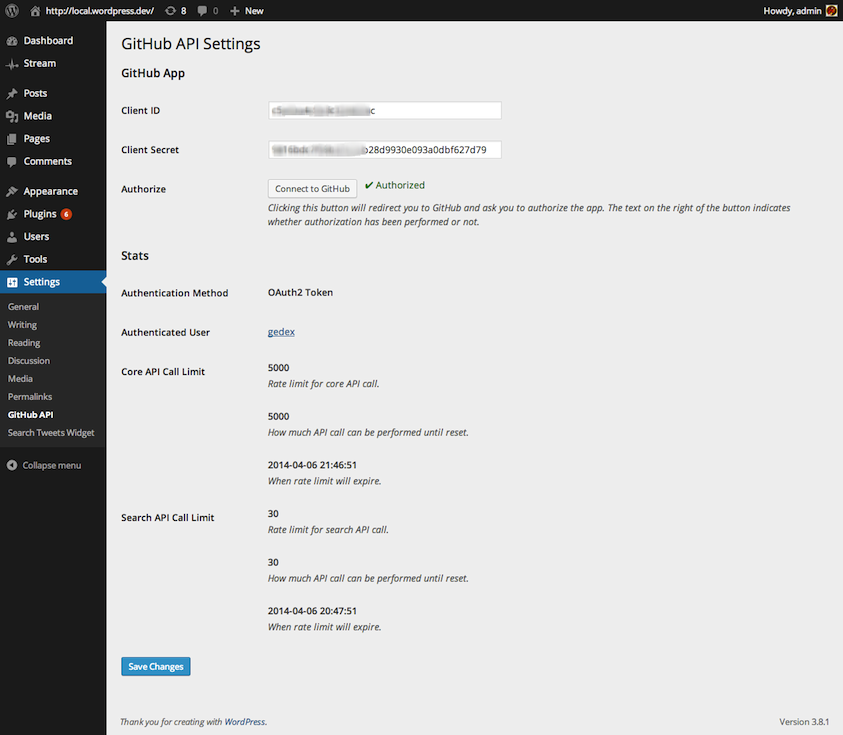
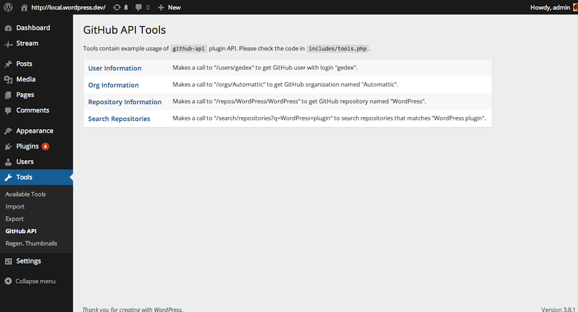
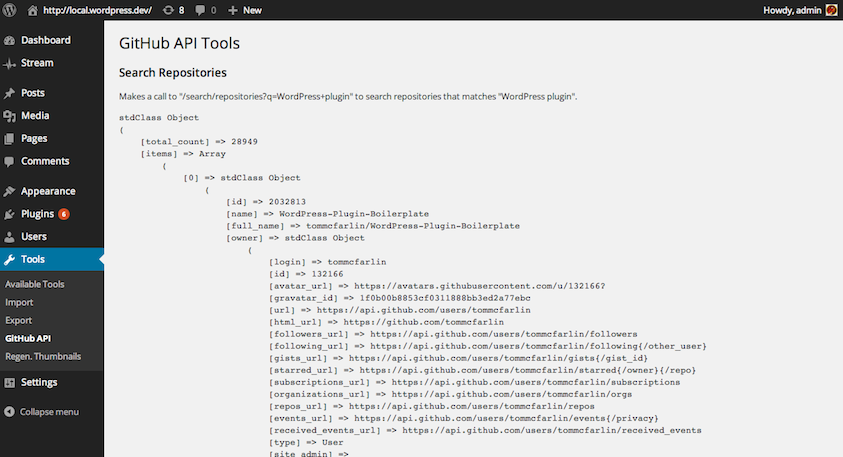
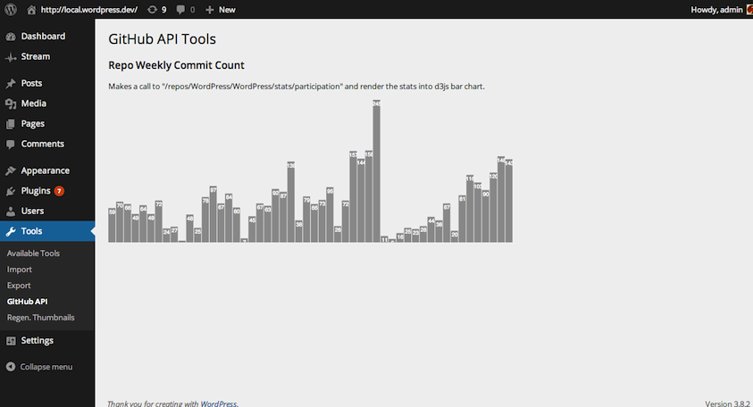

<!-- DO NOT EDIT THIS FILE; it is auto-generated from readme.txt -->
# GitHub API

This plugin contains easy-to-use API that uses WP HTTP API to make a request to GitHub API v3 resources.

**Contributors:** [akeda](http://profiles.wordpress.org/akeda)  
**Tags:** [github](http://wordpress.org/plugins/tags/github), [api](http://wordpress.org/plugins/tags/api), [oauth](http://wordpress.org/plugins/tags/oauth), [rest](http://wordpress.org/plugins/tags/rest), [http](http://wordpress.org/plugins/tags/http)  
**Requires at least:** 3.6  
**Tested up to:** 3.8.1  
**Stable tag:** trunk (master)  
**License:** [GPLv2 or later](http://www.gnu.org/licenses/gpl-2.0.html)  
**Donate link:** http://goo.gl/DELyuR  

## Description ##

This plugin doesn't contain any feature (widget or shortcode) that you can use directly once the plugin is activated. This
plugin contains API to help you in making a call to GitHub API resources. There's `includes/tools.php` file that show
you how to use the API from this plugin to make a call to various GitHub resources (for instance to get repository information).

**Development of this plugin is done on [GitHub](https://github.com/gedex/wp-github-api). Pull requests are always welcome**.

## Installation ##

1. Upload **GitHub API** plugin to your blog's `wp-content/plugins/` directory and activate.
1. There's **Settings** > **GitHub API** to view setting of the plugin.
1. There's **Tools** > **GitHub API** to test a call on GitHub resources.

## Screenshots ##

### Settings page

### Tools page

### Tool as an example to search repositories

### Tool as an example to render weekly commit count into a bar chart

## Changelog ##

### 0.1.0 ###
Initial release

